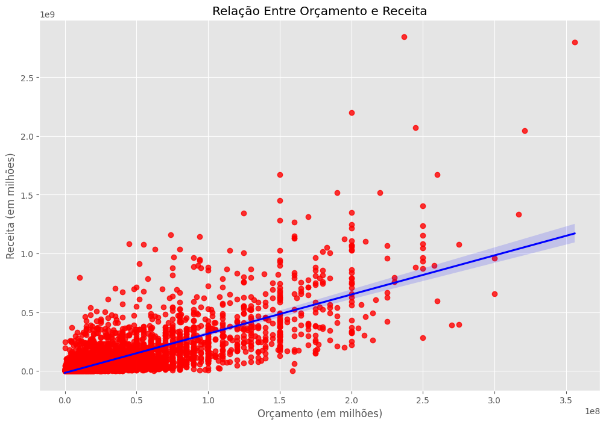

# Análise de Dados do Cinema (Pandas )

## Sobre o Projeto:

Este projeto tem como objetivo analisar fatores que influenciam o desempenho financeiro de filmes, utilizando análise exploratória de dados (EDA) e correlação estatística.

O foco principal foi investigar a relação entre:

- Budget (Orçamento)
- Gross (Receita Bruta)
- Votes (Votos do Público)
- Score (Nota Crítica)
- Runtime (Duração)
- Year (Ano de Lançamento)

---

## Objetivo:

Identificar quais variáveis possuem maior associação com a receita dos filmes e entender possíveis padrões do mercado cinematográfico.

---

## Tecnologias Utilizadas:

- Python  
- Pandas  
- NumPy  
- Seaborn  
- Matplotlib  
- Jupyter

---

## Etapas do Projeto:

### 1 Limpeza e Preparação dos Dados

- Tratamento de valores ausentes  
- Conversão de tipos de dados  
- Criação de coluna de ano correta  
- Conversão de variáveis categóricas em códigos numéricos  
- Ordenação por receita  

---

### 2 Análise Exploratória

- Scatterplot entre orçamento e receita  
- Regressão linear (Seaborn)  
- Matriz de correlação (Pearson)  
- Heatmap de correlação  

---

## Principais Resultados:

### Correlação com Gross (Receita)

| Variável | Correlação |
|----------|------------|
| **Budget** | **0.74** |
| **Votes**  | **0.63** |
| Runtime | 0.24 |
| Year | 0.25 |
| Score | 0.18 |

---

## Principais Insights:

### 1. Orçamento é o principal fator associado à receita
Filmes com maior investimento tendem a gerar maior arrecadação.

### 2. Popularidade tem forte impacto financeiro
O número de votos apresenta correlação relevante com a receita.

### 3. Nota crítica não é determinante
A correlação entre score e gross é relativamente baixa.

### 4. Mercado apresenta crescimento ao longo do tempo
Existe uma relação moderada entre ano de lançamento e receita.

---
Correlação não implica causalidade.

O fato de duas variáveis apresentarem correlação alta não significa que uma causa a outra.  
Diversos fatores estruturais podem influenciar os resultados.

---

## Conclusão:

A análise indica que o sucesso financeiro de um filme está mais associado a:

- Capacidade de investimento  
- Alcance e engajamento do público  

Enquanto avaliações críticas possuem impacto mais limitado na arrecadação.

---

## Aprendizado:

Este projeto foi desenvolvido acompanhando a aula disponível neste vídeo: https://www.youtube.com/watch?v=iPYVYBtUTyE.
Ao longo do projeto, aprofundei meus conhecimentos em conceitos e técnicas importantes 
Recomendo fortemente para quem deseja evoluir seus estudos em Data Analytics e Pandas.

